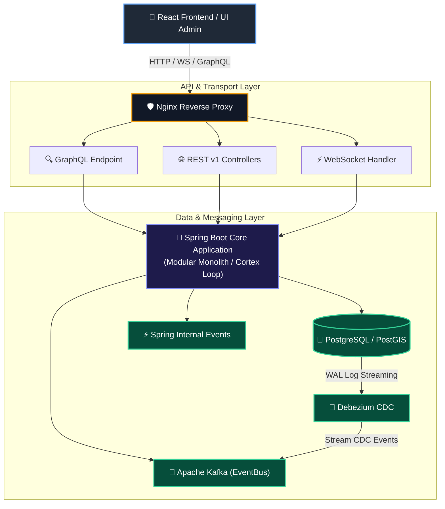
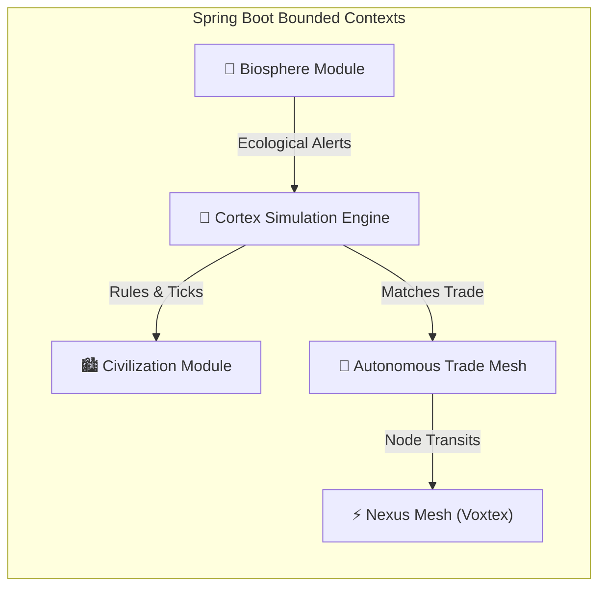
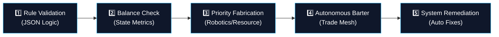
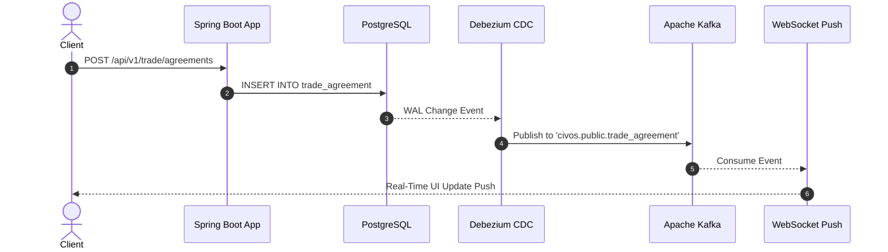
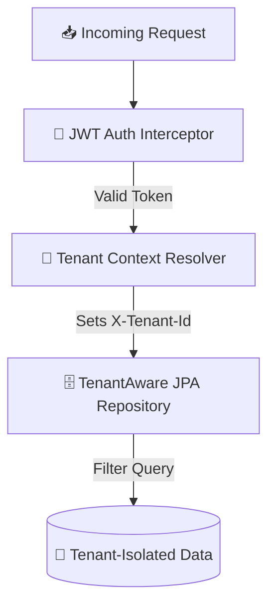

# 🏗️ System Architecture

Civilization OS is engineered around a **hybrid event-driven architecture** combining a **Modular Monolith core** for state consistency with **event-driven microservices** for decoupled scaling and real-time streaming.

---

## 🏛️ High-Level System Diagram

---

## 🧩 Architectural Layers

### 1. Backend Core (Spring Boot 3)
Organized into domain-driven modules with explicit bounded contexts:

### 2. Cortex Engine & Simulation Loop
The Cortex Engine acts as the central brain of CivOS, running scheduled simulation ticks:

- Listens to `BiosphereCriticalEvent` for instant reactive adjustments.
- Evaluates JSON logic rules against current state metrics.

---

## 🔄 Change Data Capture (Debezium CDC)

---

## 🔒 Security & Multi-Tenancy Architecture

