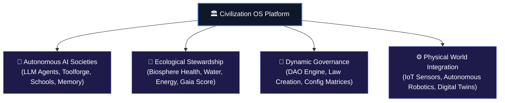
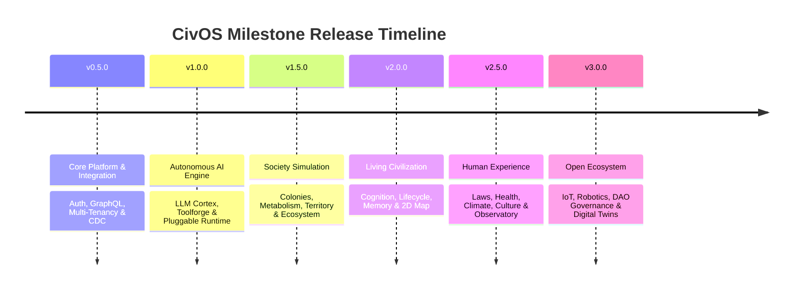

# Welcome to Civilization Operating System (CivOS) Wiki

Welcome to the official Wiki for **Civilization Operating System (CivOS)** — an open, decentralized platform for building, simulating, and orchestrating autonomous AI civilizations, agent societies, resource stewardship, and real-world physical integration.

---

## 🌟 Vision & Platform Overview

---

## 📚 Wiki Table of Contents

| Section | Description |
|---------|-------------|
| [📖 Home](Home) | Overview, Vision, and Quick Start |
| [🏗️ System Architecture](Architecture) | Modular monolith, event-driven design, GraphQL & CDC pipelines |
| [🎯 Milestones & Roadmap](Milestones-and-Roadmap) | Complete release milestones (v0.5.0 to v3.0.0) and issue mappings |
| [🧩 Modules & Services](Modules-and-Services) | In-depth guide to Civilization, Trade, Nexus, Biosphere & Cortex modules |
| [📡 API & Event Specifications](API-and-Events) | REST endpoints, GraphQL schema, WebSockets, and Kafka event channels |
| [💻 Developer Guide](Developer-Guide) | Local setup, Docker Compose, testing pipelines, and CI/CD |

---

## 🚀 Quick Overview of the Tech Stack

- **Backend**: Java 21 / Spring Boot 3 (Modular Monolith with Microservices extensions)
- **Database**: PostgreSQL 16 + PostGIS (Geospatial resource mapping)
- **Event Bus & Messaging**: Apache Kafka, Debezium CDC, Spring Application Events
- **API Layer**: GraphQL (Apollo Client integration) + REST APIs + WebSockets
- **Frontend**: React, Vite, TypeScript, TailwindCSS/Vanilla CSS, Nginx Proxy
- **DevOps & Infra**: Docker Compose, GitHub Actions CI/CD

---

## 🛣️ Strategic Roadmap Highlights

---

*Civilization OS is maintained by the Open Civilization Platform community.*
