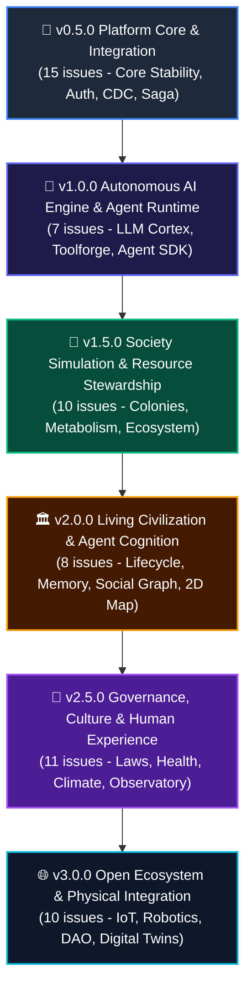

# 🎯 Milestones & Strategic Roadmap

This document outlines the strategic roadmap for **Civilization Operating System (CivOS)**, organized into **6 core milestones** covering all 61 tracked issues.

---

## 🗺️ Release Roadmap Overview

---

## 📌 Milestone Breakdown & Issue Mapping

### Milestone 1: `v0.5.0 - Platform Core & Integration`
> **Goal**: Establish core system stability, resolve frontend-backend schema drift, implement JWT auth, multi-tenancy, CI/CD, and verify CDC/Saga pipelines.

| Issue | Title | Priority | Area |
|-------|-------|----------|------|
| #2 | Integrate frontend pages with real GraphQL/API data | High | Frontend |
| #3 | Adapt frontend Voxtex pages to backend Nexus rename | High | Fullstack |
| #4 | Add login/register UI with JWT auth flow | Medium | Frontend |
| #5 | Add multi-tenancy UI — tenant selector and scoped data | Medium | Frontend |
| #6 | Improve frontend CI/CD pipeline | Medium | DevOps |
| #7 | Make frontend mobile responsive | Low | Frontend |
| #8 | Full-stack end-to-end test with Docker Compose | High | Infra |
| #9 | Setup production deployment with SSL and domain | Low | Infra/DevOps |
| #10 | Align EventBus events with Nexus backend | High | Backend |
| #11 | Align GraphQL schema with current backend entities | High | Fullstack |
| #12 | End-to-end Saga flow: frontend → backend → WebSocket feedback | Medium | Fullstack |
| #13 | Test Debezium CDC pipeline end-to-end | Medium | Infra |
| #14 | Add notifications system with WebSocket push | Medium | Fullstack |
| #15 | Admin panel — system monitoring and user management | Low | Fullstack |
| #16 | Create game lobby and multiplayer session management | Low | Fullstack |

---

### Milestone 2: `v1.0.0 - Autonomous AI Engine & Agent Runtime`
> **Goal**: Empower AI agents with real LLM reasoning, pluggable execution runtimes, tool crafting, collective education systems, safety guardrails, and an agent SDK.

| Issue | Title | Priority | Area |
|-------|-------|----------|------|
| #17 | LLM-powered Cortex Engine — replace simulated AI with real LLM agents | High | Backend / AI |
| #18 | Autonomous Agent SDK — build, deploy, and monitor AI civilizations | High | Fullstack / AI |
| #23 | AI Safety and Alignment Framework — guardrails for autonomous agents | High | Backend / AI |
| #28 | Pluggable Agent Runtime — execute autonomous AI agents inside CivOS | High | Backend / AI |
| #29 | AI Toolforge — agents can craft, evolve, and trade tools within simulation | High | Backend / AI |
| #30 | AI Knowledge & School System — agents learn, teach, and evolve skills collectively | High | Backend / AI |
| #31 | `[EPIC]` OpenClaw-style Autonomous Agent Simulation | High | Fullstack / AI |

---

### Milestone 3: `v1.5.0 - Society Simulation & Resource Stewardship`
> **Goal**: Simulate realistic societal evolution, exploration, land territory control, agent metabolism, complex supply chains, and dynamic ecosystems.

| Issue | Title | Priority | Area |
|-------|-------|----------|------|
| #32 | AI Exploration & Colony Founding — discover and settle new cities | High | Backend / AI |
| #33 | AI Resource Stewardship — manage, preserve, and regenerate natural resources | High | Backend / AI |
| #34 | Societal Evolution Engine — progress through technological & governance eras | High | Backend / AI |
| #35 | AI Immigration & Merit Selection — invite and evaluate new members transparently | High | Backend / AI |
| #36 | `[EPIC]` Living Society Simulation — explore, steward, evolve, and build | High | Fullstack / AI |
| #54 | Agent Metabolism & Energy — food, hunger, and starvation systems | High | Backend / AI |
| #55 | Territory & Land Control — settlements claim, manage, and defend land | High | Fullstack / Realworld |
| #56 | Day/Night Cycle — time of day affects visibility, energy cost, and actions | Medium | Fullstack |
| #60 | Production Chains & Complex Goods — multi-step crafting & luxury goods | Medium | Backend / AI |
| #61 | Wildlife & Ecosystem — animals roam, reproduce; agents hunt & domesticate | Medium | Fullstack |

---

### Milestone 4: `v2.0.0 - Living Civilization & Agent Cognition`
> **Goal**: Bring deep agent life, mortality, episodic memory, social graph relationships, inter-city diplomacy, persistent narrative chronicles, dynamic avatars, and interactive 2D map.

| Issue | Title | Priority | Area |
|-------|-------|----------|------|
| #37 | Agent Lifecycle & Mortality — generational knowledge transfer across lifespan | High | Backend / AI |
| #38 | AI Diplomacy & Conflict Resolution — treaties, disputes, and alliances | High | Backend / AI |
| #39 | AI Personality & Episodic Memory — character memory and growth | High | Backend / AI |
| #40 | Social Graph & Relationships — friendships, rivalries, mentorships, factions | Medium | Backend / AI |
| #41 | Civilization Chronicle — persistent narrative history and mythology | Medium | Fullstack / AI |
| #42 | Interactive Agent Map — real-time 2D visualization of agents, cities, resources | High | Frontend |
| #43 | `[EPIC]` Living Civilization Simulator — complete agent society in a visible world | High | Fullstack / AI |
| #50 | Visual Avatars — dynamic portraits reflecting age, mood, health, rank | Medium | Frontend |

---

### Milestone 5: `v2.5.0 - Governance, Culture & Human Experience`
> **Goal**: Implement dynamic law-making, agent communication, health/epidemics, climate/seasons, artistic creation, human player interaction, and global planetary observatory.

| Issue | Title | Priority | Area |
|-------|-------|----------|------|
| #44 | Agent Communication & Language — messaging, gossip, negotiation | High | Backend / AI |
| #45 | Dynamic Governance & Law-Making — create laws, vote, evolve government | High | Backend / DAO |
| #46 | Health, Disease & Medicine — illness, disease spread, medical care | Medium | Backend / AI |
| #47 | Climate, Seasons & Natural Disasters — weather, seasons, catastrophes | Medium | Backend |
| #48 | Culture & Art — music, stories, festivals, and architectural identity | Medium | Fullstack / AI |
| #49 | `[OPTIONAL]` Monetary Economy — credit, banking, and transitional markets | Low | Backend / DAO |
| #51 | Tourism & Pilgrimage — cross-civilization visits for culture and trade | Low | Fullstack / AI |
| #52 | Civilization Config Matrix — track thriving socio-economic models | High | Fullstack / DAO |
| #53 | `[EPIC]` The Complete Human Experience — governance, health, culture, choice | High | Fullstack / DAO |
| #58 | Human Players — real people play alongside AI agents | Medium | Fullstack |
| #62 | Planetary Observatory & Global Health System — Gaia Scoreboard & warnings | High | Fullstack |

---

### Milestone 6: `v3.0.0 - Open Ecosystem & Physical Integration`
> **Goal**: Bridge the simulation to the real world through IoT sensors, autonomous robotics control, federated CivOS protocol, on-chain DAO governance, digital twin platform, and public SDK.

| Issue | Title | Priority | Area |
|-------|-------|----------|------|
| #19 | IoT and Real-World Sensor Integration — connect physical resources | High | Backend / Robotics |
| #20 | Autonomous Robotics Control Interface — drones, bots, and automation | High | Backend / Robotics |
| #21 | Open Civilization Protocol — federate multiple CivOS instances | High | Backend |
| #22 | DAO Governance Engine — on-chain voting for collective decisions | High | Fullstack / DAO |
| #24 | Real Resource-Backed Currency — tokenize physical resources | Medium | Backend / DAO |
| #25 | Digital Twin Platform — real-time mirror of physical communities | Medium | Fullstack / Robotics |
| #26 | Decentralized AI Training — federated learning from autonomous agents | Medium | Backend / AI |
| #27 | Plugin/Extension Ecosystem — third-party modules for CivOS | Medium | Fullstack |
| #57 | Plugin SDK — public extension API for agent types, biomes, crises | Medium | Backend / Infra |
| #59 | Simulation Inspector — visual debugger to pause, replay, inspect decisions | Medium | Fullstack / Infra |
