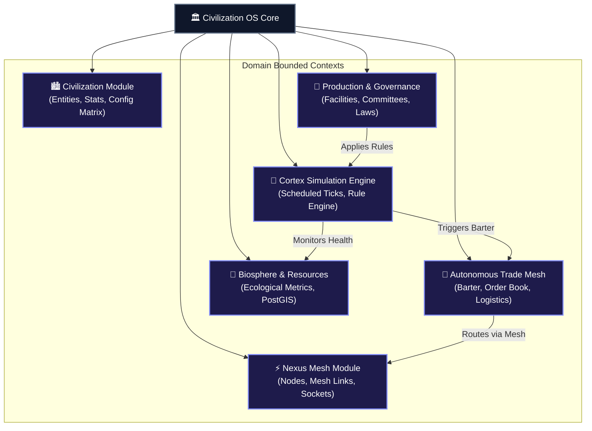

# 🧩 Modules & Services

Civilization OS is built as a **Modular Monolith** containing specialized domain modules. Each module maintains strict isolation of domain entities, business logic, and API endpoints.

---

## 🏛️ Domain Modules Architecture

---

## 1. 🏙️ Civilization Module (`io.github.opencivilizationplatform.modules.civilization`)
Manages the core state, population, statistics, and ideological configuration matrix of each civilization instance.

- **Domain Entities**: `Civilization`, `Population`, `ConfigMatrix`, `Ideology`
- **Key Services**:
  - `CivilizationService`: Handles creation, status updates, and metric calculation.
  - `ConfigMatrixService`: Manages socio-economic configuration parameters.
- **REST Endpoints**: `/api/v1/civilizations/**`

---

## 2. ⚡ Nexus Mesh Module (`io.github.opencivilizationplatform.modules.nexus`)
*Formerly Voxtex Mesh*. Provides the inter-node communication network and state synchronization across settlements and regions.

- **Domain Entities**: `NexusNode`, `NexusLink`, `NetworkCluster`
- **Key Services**:
  - `NexusMeshService`: Coordinates node connectivity, throughput, and mesh routing.
- **WebSocket Endpoint**: `/ws/nexus`

---

## 3. 🤝 Autonomous Trade Mesh (`io.github.opencivilizationplatform.modules.trade`)
Facilitates automated barter, trade agreements, resource transits, and market equilibrium between agents and settlements.

- **Domain Entities**: `TradeAgreement`, `ResourceOrder`, `Shipment`
- **Key Services**:
  - `TradeService`: Matches surplus and deficit resources across node networks.
  - `ShipmentService`: Tracks logistics and physical/digital transits.
- **REST Endpoints**: `/api/v1/trade/agreements`, `/api/v1/trade/shipments`

---

## 4. 🌿 Biosphere & Resource Module (`io.github.opencivilizationplatform.modules.biosphere`)
Monitors planetary health, water reserves, energy grids, agricultural yield, and natural resource regeneration.

- **Domain Entities**: `ResourceRegion`, `BiosphereMetrics`, `EcologicalAlert`
- **Events Emitted**: `BiosphereCriticalEvent` (triggered when ecological metrics breach safety thresholds).

---

## 5. 🧠 Cortex Simulation Module (`io.github.opencivilizationplatform.modules.cortex`)
The autonomous scheduling engine that evaluates rules, balances supplies, triggers robot fabrication, and resolves system remediation.

- **Key Services**:
  - `CortexEngine`: `@Scheduled` execution loop running tick cycles.
  - `RuleService`: Evaluates JSON-based logic rules against live state.
  - `BalanceService`: Generates state balance reports and triggers automated remedies.

---

## 6. ⚙️ Production & Governance Modules
- **Production**: Facilities, manufacturing chains, labor allocation, multi-step crafting.
- **Governance**: Rule controllers, committee management, voting engines, and law enforcement.
